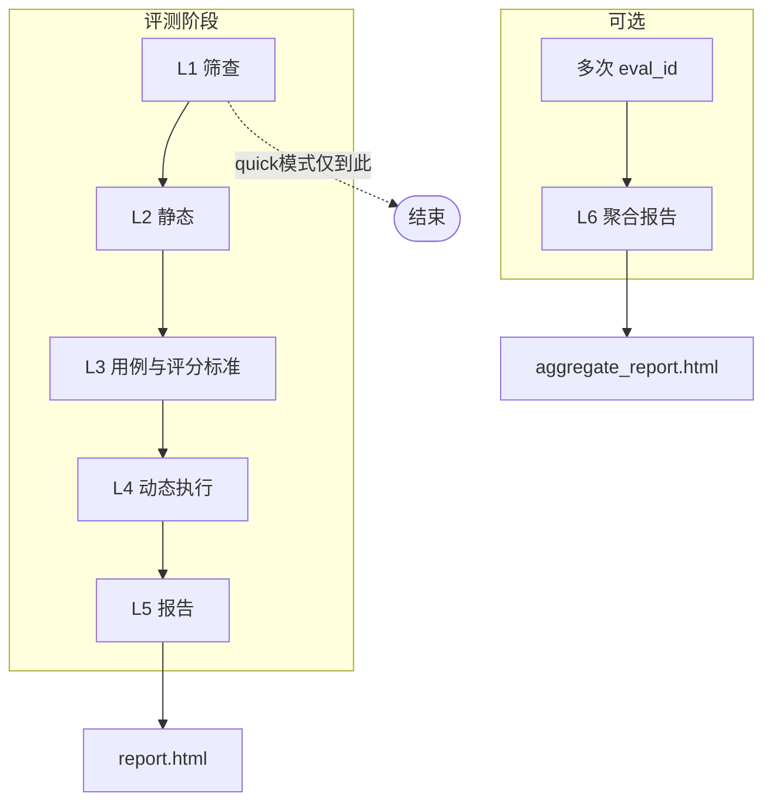
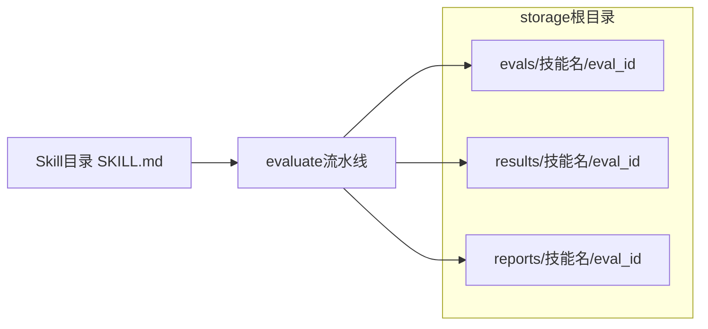
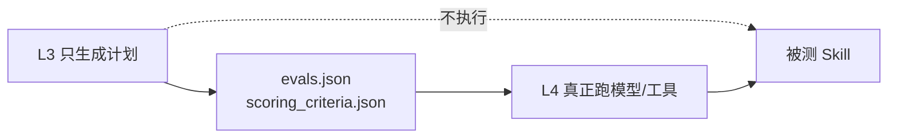
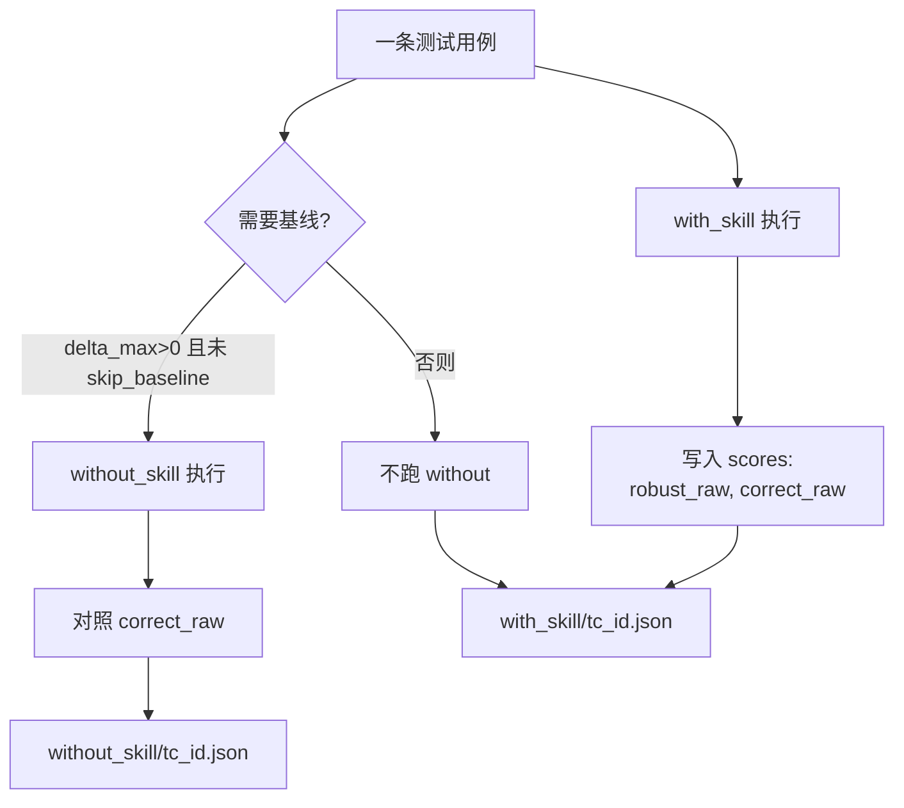

# skill-evaluator 使用说明与架构（面向使用者）

> **skill-evaluator** 用于自动评测 AI Skill（Claude / Cursor 等工具插件）质量，输出 **HTML 报告** 与结构化数据。本文从**使用者视角**说明：如何跑评测、结果在哪、**如何读懂分数与 Layer 4（动态评估）细节**；实现细节与仓库代码路径见各节标注。

---

## 第一部分：你能用它做什么

### 1.1 解决的问题

| 诉求 | 评测能给出的东西 |
|------|------------------|
| 这个 Skill 整体质量如何？ | **总分 /100**、等级 **A–F**、是否 **PASSED** |
| 代码与合规有没有明显问题？ | L1 筛查 + L2 静态质量/安全维度得分 |
| Skill 在真实输入上靠不靠谱？ | **L4 动态评估**：逐条用例的健壮性、正确性（及可选的「相对纯 LLM」增量） |
| 多次改版怎么对比？ | **聚合报告**（多个 `eval_id`） |

### 1.2 一次完整评测会产出什么

- **HTML 报告（首选阅读）**：`storage/reports/{skill_name}/{eval_id}/report.html`  
  评测结束若本机支持，CLI 可能自动尝试打开浏览器。
- **结构化数据**：同目录下 `eval_data.json`（总分、各层摘要、`score_breakdown`、用例列表等）。
- **L4 原始快照**（排障必备）：  
  `storage/results/{skill_name}/{eval_id}/with_skill/{用例ID}.json`  
  若开启基线对照，还有 `without_skill/{用例ID}.json`。

`eval_id` 形如：`{skill_name}-YYYYMMDD-HHMMSS-{8位随机}`，终端 JSON 里也会打印。

---

## 第二部分：从命令行到报告（怎么操作）

### 2.1 你需要准备什么

- **Python 3.11+** 与项目依赖已安装（见仓库 `README` / `pyproject`）。
- **LLM 相关密钥与模型**：至少配置 **`ANTHROPIC_API_KEY`** 和/或 **`OPENAI_API_KEY`**（与执行路径有关），以及可选的 **`JUDGE_MODEL`**、**`EVAL_MODEL`**（见下文环境变量表）。
- **被测 Skill 路径**：本地目录（含 `SKILL.md`），或 **GitHub 仓库 HTTPS 地址**（框架会浅克隆）。

### 2.2 最常用：跑一轮完整评测

在项目根目录（或已安装 CLI 的环境）执行：

```bash
python -m evaluator.cli evaluate /path/to/your/skill --mode full
```

**常用可选参数（记住这 5 个就够）**：

| 参数 | 作用 |
|------|------|
| `--mode quick` | 只做 **L1**，适合快速看「会不会被拦」 |
| `--with-baseline` | L4 增加 **without_skill** 对照，算「增量价值」分；**耗时与 token 大约多一倍** |
| `--output-dir /某目录` | 指定存储根，等价于环境变量 `STORAGE_BASE_DIR` |
| `--evals-file 某.json` | 不用自动生成，改用你提供的用例文件 |
| `--max-cases N` | 限制 L3 生成的用例条数 |

**注意**：若你**同时**传了 `--evals-file` 和 `--criteria-file`，框架会认为你在做「完全自定义批次」，**不会跑基线对照**（与 `--with-baseline` 同时存在时也会按此规则处理）。仅自定义用例、未自定义标准时，行为见实现 `Layer3TestGen`。

### 2.3 中断后继续跑（省时间与费用）

评测在 L4 中断（网络、手动停止等）时，**不必从头再来**：

```bash
python -m evaluator.cli resume /path/to/your/skill <你的eval_id>
```

- 会 **跳过 L1–L3**，只补跑未完成的用例，再生成报告。
- `--retry-failed`：对「跑完了但正确性为 0」的成功态用例再跑一遍（适合偶发 API 错误）。
- `--with-baseline`：若上次没跑 without，可在 resume 时补上。

### 2.4 只重生成 HTML（不改 L4 结果）

```bash
python -m evaluator.cli regenerate-report /path/to/your/skill <eval_id>
```

适合：模板或展示逻辑更新后，**同一批快照**重新出报告。

### 2.5 多轮评测对比（聚合）

```bash
python -m evaluator.cli aggregate eval_id_1 eval_id_2 --storage-base ./storage
```

要求每个 `eval_id` 下已有完整报告数据；**同一 Profile 下** `profile_weight_snapshot` 必须一致（见后文）。

---

## 第三部分：架构总览（多图）

### 3.1 五层 + 聚合在一条时间线上



### 3.2 数据落盘：你该去哪个文件夹找东西



### 3.3 L3 与 L4 的分工（读 L4 前必看）



- **L3**：根据 `SKILL.md`（或你提供的文件）生成**测什么、怎么判**；**不调用被测 Skill 的业务逻辑**。
- **L4**：按用例真正执行 **with_skill**（带上 Skill）运行；在条件允许时再做 **without_skill**（纯模型基线）。

### 3.4 Layer 4 单条用例在干什么（概念图）



---

## 第四部分：如何读懂评分与报告

### 4.1 总分与等级

- 报告顶部有 **总分 /100** 与 **等级 A–F**。
- 等级与是否 **PASSED** 由阈值分段决定（例如 90+ 为 A 等），具体见 `evaluator/config.py` 中 `GRADE_THRESHOLDS`。

### 4.2 「评分总览」表里每一行是什么

HTML 中的 **评分总览**（或 `eval_data.json` 里的 `score_breakdown`）按维度列出 **得分 / 满分**。典型包含：

| 报告中的维度（示意） | 大致来源 | 使用者怎么理解 |
|----------------------|----------|----------------|
| 与 L1 相关 | L1 筛查 | 元数据、结构类检查的综合贡献 |
| 质量 / 安全等 | L2 静态 | 代码质量、安全扫描等 |
| **健壮性** | **L4** | 用例是否在异常输入、格式等下仍「站得住」 |
| **正确性** | **L4** | 用例输出是否满足本题 rubric / 断言 |
| **增量价值** | **L4**（仅开启基线且该 Profile 有 delta 分时） | 相对 **without_skill**，Skill 是否带来更高正确性 |

每项 **满分** 来自当次评测冻结的 **`profile_weight_snapshot`**，与 Skill 的 **eval_profile**（deterministic / generative / workflow / no_code）一致，**不是**手填固定表。

### 4.3 默认不开启 `--with-baseline` 时

- 配置会把原「增量价值」权重 **合并进正确性**（仍满分 100），所以你**看不到**单独的「增量价值」一行，但 **正确性** 仍反映「带 Skill 跑」的表现。
- 终端可能提示：若要衡量相对纯 LLM 的提升，可加 `--with-baseline`（成本更高）。

### 4.4 开启 `--with-baseline` 时，报告多看什么

在 HTML 中（数据来自 `effect_validation`）通常可看到：

- **总览横幅**：With / Without 正确率对比、Delta 百分比、**增量价值得分 / 满分**。
- **耗时与 Token 对比**：帮助判断 Skill 是否「更贵但更值得」。
- **逐用例表**：每条用例在 with / without 下的表现，便于定位「哪些题 Skill 真有用」。

若某 Profile 本身 **delta_max=0**（如 generative / no_code），则不会做 without 对照，也不会有上述区块。

### 4.5 想抠细节时：点进 L4 用例区

报告中 **用例分析 / 执行路径** 等区域（以当前模板为准）会按用例展示：

- **优先级** P0 / P1 / P2（P0 更重要；全 P0 健壮性失败可能导致阻断）。
- **结果**：通过 / 部分通过 / 失败。
- **执行方式**：如 CLI、API 等（以报告字段为准）。
- **输出预览**、超时提示、断言未通过提示等。

**原始 JSON** 路径：`storage/results/{skill}/{eval_id}/with_skill/{tc_id}.json`  
内含 `scores.robust_raw`、`scores.correct_raw`、`status`、`output` 等，适合开发自证。

---

## 第五部分：动态评估层（Layer 4）详细说明（使用者向）

### 5.1 一句话

**L4 = 按 L3 写好的用例，在真实环境里带 Skill（和不带 Skill）跑一遍，把 0–1 的原始分按权重换成「健壮性 / 正确性 / 可选增量」得分。**

### 5.2 输入从哪来（与 L3 绑定）

- 同一次评测、同一 `eval_id` 下必须有 **`evals.json`** 与 **`scoring_criteria.json`**（同目录）。
- L4 会校验两者 **`eval_id` 一致**，且权重快照合法，否则直接报错（避免错绑分数）。

### 5.3 什么时候会跑「两遍」（with + without）

同时满足：

1. 当前 Profile 的 **`delta_max > 0`**（关闭 baseline 时配置里会把 delta 合并到 correct，此时不跑 without）；  
2. 本次运行 **`skip_baseline` 为 false**（默认未同时提供 evals+criteria 两个自定义文件时，且你开了 `--with-baseline`）。

**不会跑 without** 的典型情况：`generative`、`no_code` Profile；或你同时上传了 evals+criteria 自定义全套；或未开 `--with-baseline`。

### 5.4 分数怎么从「原始分」变成「卷面分」

对**全部用例**先算平均：

- `avg_robust`：各用例 `robust_raw` 平均（0–1）。
- `avg_correct_with`：各用例 **with_skill** 的 `correct_raw` 平均。
- `avg_correct_without`：若有 without，则为 **without_skill** 的 `correct_raw` 平均，否则在公式里按实现不参与或视为 0。

再乘 **当次 Profile 满分**：

- **健壮性得分** ≈ `avg_robust × robust_max`
- **正确性得分** ≈ `avg_correct_with × correct_max`
- **增量价值得分**（若启用）：  
  `delta_raw = avg_correct_with - avg_correct_without`  
  `delta_normalized = max(0, delta_raw + DELTA_NORMALIZE_OFFSET)`（默认 offset **0.5**）  
  **增量价值得分** = `delta_normalized × delta_max`

直觉：和基线**打平**时仍约拿一半增量分；明显好于基线则趋近满分；不如基线则趋近 0。

### 5.5 并发与稳定性（你只需要知道后果）

- 有 **Claude CLI** 时，多条用例可能 **并行**，整体更快。
- 纯 API 路径在部分配置下会 **降并行**，减少限流（429）；表现为跑得慢但更稳。

### 5.6 什么情况下评测会「阻断」

举例（以实际抛出为准）：**所有 P0 用例**在健壮性上失败；或 API 认证连续失败达到阈值等。部分用例失败**不一定**整批立刻停——以报告与日志为准。

### 5.7 长任务与续跑

- L4 可能写 **进度信息** 到存储，便于外部轮询（实现细节见代码）。
- 用 **`resume`** 从断点继续，避免重复烧 L1–L3 与已完成用例。

---

## 第六部分：评测 Profile 与附录表

### 6.1 Profile 是什么

由 `skill.json` / `SKILL.md` 的 **type**、仓库里 **是否有代码**、以及描述/**关键词** 推断，决定用哪套 **满分拆分**（`eval_profile`）。

### 6.2 原始配置表（开启 `--with-baseline` 时的典型拆分）

| Profile | L1 | quality | security | robust | correct | delta | 合计 |
|---------|-----|---------|----------|--------|---------|-------|------|
| deterministic | 15 | 15 | 20 | 8 | 12 | 30 | 100 |
| generative | 15 | 5 | 15 | 10 | 55 | 0 | 100 |
| workflow | 15 | 10 | 15 | 8 | 22 | 30 | 100 |
| no_code | 20 | 0 | 10 | 15 | 55 | 0 | 100 |

关闭 `--with-baseline` 时，实现上会把 **delta 权重合并进 correct**，表中「correct+delta」可对照理解。

---

## 第七部分：环境变量（自助排查）

| 变量 | 含义 |
|------|------|
| `ANTHROPIC_API_KEY` | Anthropic |
| `OPENAI_API_KEY` / `OPENAI_BASE_URL` | 兼容 OpenAI 的网关 |
| `JUDGE_MODEL` / `EVAL_MODEL` | 判分模型 / 执行用例模型 |
| `STORAGE_BASE_DIR` | 存储根，默认 `./storage` |
| `LAYER3_TIMEOUT` | L3 超时（秒） |
| `LAYER4_CASE_TIMEOUT` / `LAYER4_TOTAL_TIMEOUT` | L4 单用例 / 总超时 |
| `JUDGE_PASSING_THRESHOLD` | Judge 阈值 |
| `DELTA_NORMALIZE_OFFSET` | 增量归一化偏移，默认 `0.5` |

---

## 第八部分：聚合层（L6）使用者须知

- 至少 **2 个** `eval_id`。
- 每个 eval 下需能找到 **`eval_data.json`** 与 **`scoring_criteria.json`**。
- **同一 Profile** 聚合时，各次的 **`profile_weight_snapshot` 必须完全一致**，否则报错。
- 若跨 Profile 混合聚合，实现可能发出警告并采用特殊处理（见 `layer6_aggregate`）。

---

## 附：与实现一致性说明

本文与仓库 **`evaluator/pipeline.py`**、**`evaluator/config.py`**、**`evaluator/layers/layer3_testgen.py`**、**`evaluator/layers/layer4_dynamic.py`**、**`evaluator/layers/layer5_report.py`** 保持一致；若代码变更，以代码与 `CLAUDE.md` 为准。

**Mermaid 图**：若语雀编辑器不渲染，可将代码块复制到支持 Mermaid 的预览工具查看。

---

*文档维护：skill-evaluator 仓库 `docs/skill-evaluator-product.md`*
